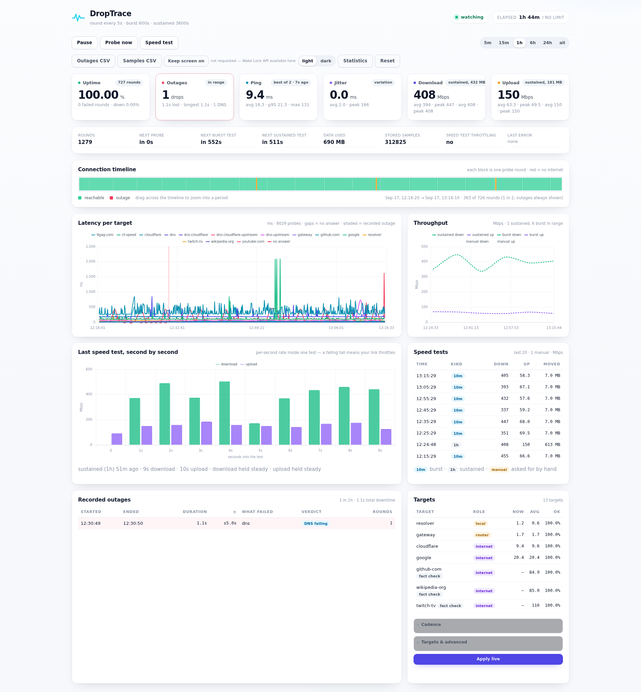
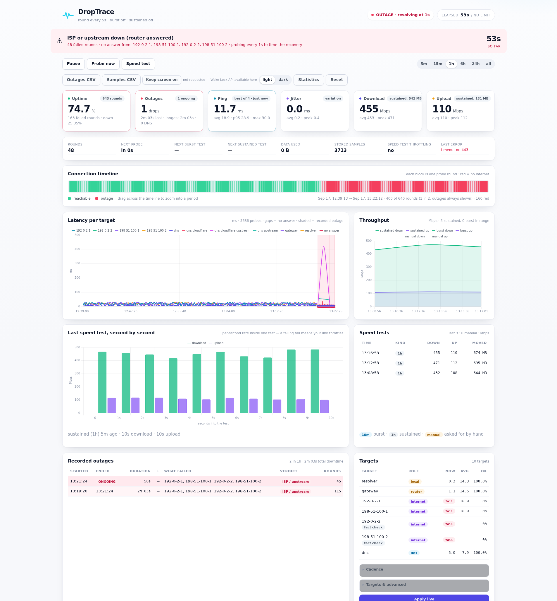
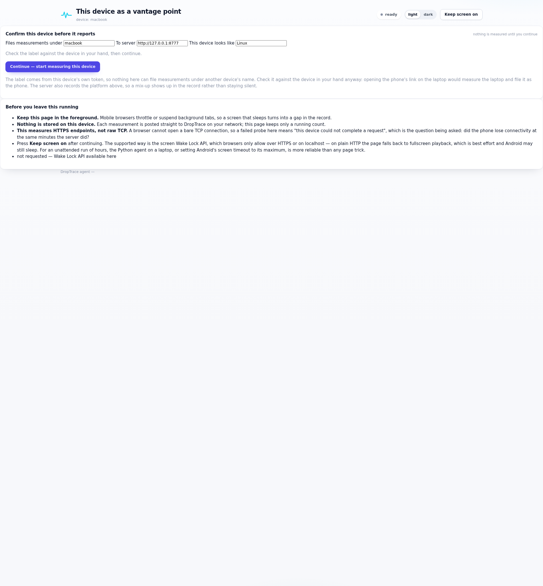
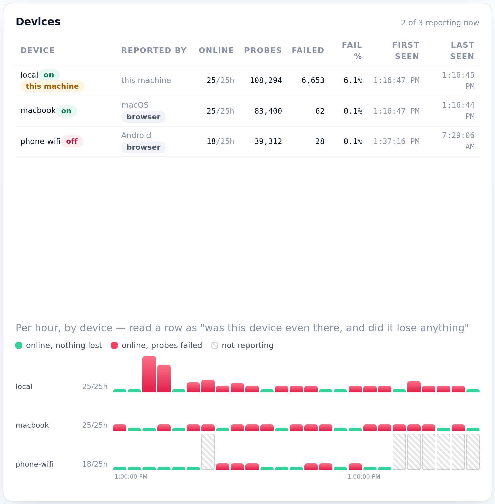
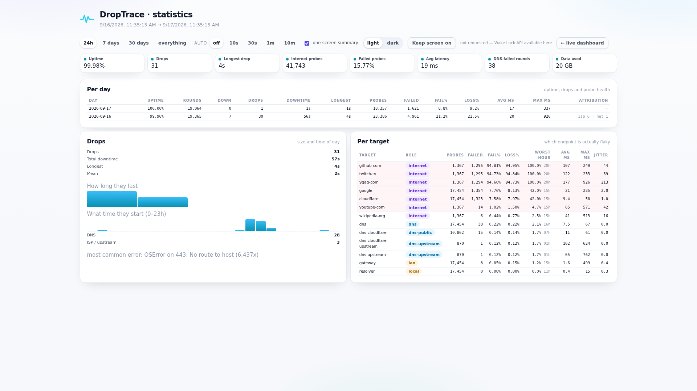
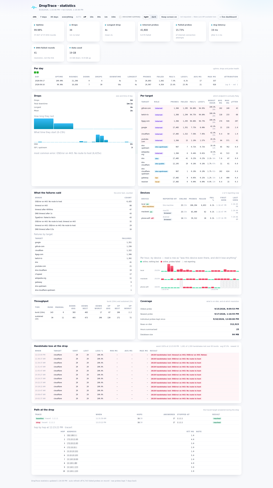
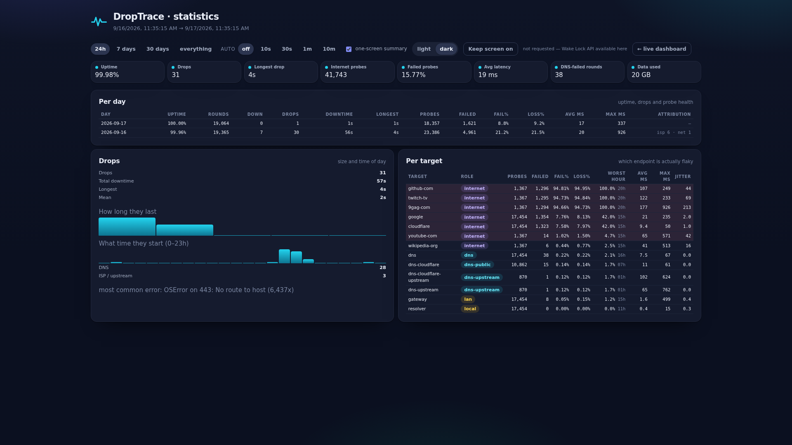

# DropTrace

A continuous connectivity monitor that turns intermittent internet drops into
**evidence**: a timestamped table of every outage, how long it lasted, and which
part of the path failed.

It exists because a speed test only sees its own instant. If your connection
drops for five seconds every few minutes, any test you run by hand will almost
always land in a healthy window and report that everything is fine. The only way
to catch it is to probe constantly and write down what happened.

```
Timeline (each block = one 2s probe round)
▉▉▉▉▉▉▉▉▉▉▉▉▉▉▉▉▉▉▉▉▉▉▉▉▉▉▉▉█▉▉▉▉▉▉▉▉▉▉▉▉▉▉▉▉▉▉▉▉▉▉▉▉▉▉▉▉▉▉▉▉▉▉▉▉▉▉▉
                                ▲
                                outage: 13.4s
```



And here is the same dashboard during a drop — the red banner, the red blocks on
the timeline, the gap in the latency line, the incident row that records it, and
the pill reporting that probing has sped up to time the recovery. (Staged for the
screenshot against unreachable test addresses, so the failed targets are
`192-0-2-1` and `198-51-100-1` rather than real ones — note the router row still
answering, which is what makes the verdict *"ISP or upstream down (router
answered)"* rather than a guess.)



*(That capture is from a deliberately simulated outage — the internet targets
pointed at an unroutable address — so the failed target is a test address rather
than a real one. A genuine ISP drop looks the same, with real target names.)*

A sustained speed test takes 10s per direction and moves hundreds of megabytes,
so it shows what it is doing while it does it: pressing **Speed test** opens a
card with a bar and a live rate per direction, and it keeps counting if you hide
it. (That capture is a moving target — it exists for ten seconds while a real
transfer is running — so the numbers to read afterwards are the *Last speed
test, second by second* panel in the dashboard shot above.)

## What it does

Every **5 seconds** (configurable, changeable live from the web page) it probes
several targets at once and writes one row per target.

Throughput is measured on **two tiers**, because one test cannot answer both
questions:

| Tier | Default | What it moves | Answers |
|---|---|---|---|
| **Burst** | every 10 min | 5 MiB down + 2 MiB up (~7 MB) | "what is my peak right now" |
| **Sustained** | every hour | 10 s down + 10 s up (~775 MB) | "does it hold up, or throttle" |

Each tier can be disabled independently (interval `0`). Every run also records
whether it was **scheduled** or **manual**, so the view can tell a test the clock
started from one you asked for: the chart draws manual runs as amber diamonds,
the speed-tests table labels each run `10m`, `1h` or `manual`, and the
per-second panel says which test it is showing.

On a fresh install the first sustained test runs about a minute after startup
rather than making you wait a whole interval, and it is *not* re-run on a restart
if a recent one is already stored — so restarting never silently costs another
775 MB. See
[why the sustained test runs on a timer](#why-the-sustained-test-runs-on-a-timer).

| Target | Role | What a failure tells you |
|---|---|---|
| Your router (auto-detected) | `lan` | your router / Wi-Fi / host is unreachable |
| 5 hosts on other networks | `internet` | *corroboration*: probed when a drop is suspected, and every 15 min |
| DNS resolver (`/etc/resolv.conf`) | `local` | the resolver stopped answering (not LAN evidence) |
| `1.1.1.1:443`, `8.8.8.8:443` | `internet` | the ISP or upstream dropped |
| DNS lookup of `one.one.one.one` | `dns` | the internet works but name resolution is broken |
| The same lookup at another resolver | `dns-public` | *comparison*: is resolution broken on the line, or only at your resolver? |
| An uncached (random) name at each resolver | `dns-upstream` | the resolver answers from cache but can no longer reach upstream |

A round is **down** when no `internet` target answers. Comparing the roles is
what turns a pile of failed connects into a verdict — and only the `lan` role is
allowed to make the claim, because only that probe has to cross the cable to the
router:

| internet | router | Verdict |
|---|---|---|
| down | answering | **ISP or upstream** — your router answered, so the LAN was fine |
| down | also down | **Local network** — router / Wi-Fi / host |
| down | no router evidence | **Internet unreachable (no router evidence)** |
| up | up | DNS failing (tracked as its own incident kind) |

### Confirming a drop with other networks

Two endpoints are a thin basis for calling the internet down. If `1.1.1.1` is
filtered on your line, or Cloudflare has a bad minute, every other row of
evidence looks like an outage. So DropTrace keeps a small pool of hosts on
**different networks** -- `github.com` (Azure), `wikipedia.org` (Wikimedia),
`twitch.tv` (Amazon), `youtube.com` (Google), `9gag.com` (Cloudflare's CDN) --
and probes them exactly when it matters:

* **when a round looks like a drop**, so the incident records that five other
  networks were dark at the same moment, and
* **once every 15 minutes regardless** (the *baseline* pass), because a host your
  ISP blocks would otherwise sit in the pool looking like a witness while never
  answering. The baseline is what makes the corroboration credible.

They also count towards the verdict, which means they can *cancel* a false alarm:
if the two primary targets time out but GitHub, Wikipedia, Twitch, YouTube and
9GAG all answer, the round is **up** and no incident is opened -- correctly, since
those five networks just proved the link works. Verified live: primary targets
blackholed, pool healthy -> `internet_ok: true`, no incident, no fast mode; all
five blackholed -> an `isp` incident whose failed list names all five.

They are hostnames, so they need DNS; the primary targets stay raw IPs for exactly
that reason, and a broken resolver leaves the verdict to the IPs while the `dns`
role reports the real problem. Cost: five connects every 15 minutes, plus five per
round while a drop is being investigated. Set `fact_check_targets` to an empty
string to turn the whole thing off, or `fact_check_interval: 0` to skip the
baseline and only ever probe them on suspicion. The Targets table marks them
`fact check`, and they are never stood down by probation -- one outage would
otherwise retire the entire pool, since they are only probed when things fail.

That last row is the honest one, and it is why the router is probed at all: the
resolver under WSL is a proxy *inside* the VM (`10.255.255.254` sits on loopback),
so it keeps answering with the cable pulled, and anything that trusts it would
blame the ISP for a problem it never tested. Use `--lan-gateway IP` if
auto-detection picks the wrong router, or `--no-gateway` to drop the probe
entirely (drops are then always "no router evidence").

An outage row opens on the first failed round and closes when a round succeeds,
so you get a start time, an end time, a duration, the failed targets and the
underlying error for every drop.

## Install and run

**Requirements:** Python 3.10 or newer. Dependencies are four small pure-Python
packages (`fastapi`, `uvicorn`, `httpx`, `aiosqlite`) — no compiler, no
JavaScript build, no Docker.

You only need a terminal **once** (to install dependencies). After that it is a
double-click, and everything else happens on the web page.

If the packages are already installed, nothing else is needed — `make` and the
launchers use the project's `.venv` when it can import them and fall back to the
plain `python3` otherwise, so a machine without `python3-venv` (no `ensurepip`)
still runs. To build a venv deliberately: `sudo apt install python3-venv && make install`.

### Windows: double-click `start.bat`

`start.bat` starts DropTrace inside WSL, waits for it to answer, and opens the
dashboard in your browser. Leave the window open while you monitor; close it (or
press Ctrl+C) to stop. Edit the `DISTRO` / `PORT` lines at the top if you need to.

### WSL or Linux: `./start.sh`

```bash
cd droptrace
./start.sh              # starts, then opens the dashboard in your browser
```

### Or explicitly

```bash
cd droptrace
python3 -m venv .venv && .venv/bin/pip install -r requirements.txt
.venv/bin/python -m droptrace serve
```

Or with make, which does the above for you:

```bash
make install          # creates .venv and installs requirements (once)
make serve            # dashboard on http://127.0.0.1:8777/
make open             # same, but also opens your browser
```

`python3 -m droptrace serve --open` does the same thing and opens the browser
itself. Nothing else is needed — there is no build step and no CDN: Chart.js is
vendored locally, so the dashboard renders even while your connection is down.

### Then use the web page for everything

Once it is running, **http://127.0.0.1:8777/** is the control panel. No further
commands are needed:

| On the page | Does |
|---|---|
| Pause / Resume | stop and restart sampling without losing history |
| Probe now | run one probe round immediately |
| Speed test | run a throughput test immediately |
| Cadence panel | change probe interval, speed-test interval and run length — applied live |
| **Targets & advanced** | change the target list, gateway/resolver toggles, DNS probe name, payload sizes, parallel streams, connect timeout, and how many failed rounds make an outage |
| Range chips | 5m / 15m / 1h / 6h / 24h / all |
| Drag the timeline | zoom to an exact period; the cards, charts and outage table all follow it |
| Outages CSV | download the outage evidence |
| Samples CSV | download every raw probe |
| Reset | clear stored samples and outages |

The only things that still need a restart are the bind address and port, the
database path, and the retention window — because they describe where the server
itself runs.

### Reaching it from your phone or another device

By default it listens only on `127.0.0.1`, so nothing else can reach it. Binding
to all interfaces makes it available on your network:

```bash
python3 -m droptrace serve --bind 0.0.0.0
```

The startup banner then prints every address it is reachable at, so you do not
have to guess:

```
  → local    http://127.0.0.1:8777/
  → network  http://192.168.1.51:8777/   <- from another device on this network
```

See **[LOCAL-NETWORK.md](LOCAL-NETWORK.md)** for the full walkthrough with
verification steps and troubleshooting.

**Under WSL2 this is not enough on its own.** WSL sits behind its own NAT, so
binding inside WSL does not expose the port to your LAN — Windows has to bridge
it. Two ways, both needing one-time setup on the Windows side:

*Mirrored networking* (Windows 11 22H2 or newer; recommended). Create
`%UserProfile%\.wslconfig`:

```ini
[wsl2]
networkingMode=mirrored
firewall=false
```

Then run `wsl --shutdown` from PowerShell and start WSL again. WSL shares the
host's interfaces, so the banner's `network` line becomes your real LAN address
and your phone can open it. **`wsl --shutdown` terminates everything running in
WSL**, including this monitor and any containers.

*A port forward* (any WSL2, if you would rather not change WSL networking). From
an administrator PowerShell:

```powershell
$wslIp = (wsl.exe hostname -I).Trim().Split()[0]
netsh interface portproxy add v4tov4 listenport=8777 listenaddress=0.0.0.0 connectport=8777 connectaddress=$wslIp
New-NetFirewallRule -DisplayName "DropTrace 8777" -Direction Inbound -Protocol TCP -LocalPort 8777 -Action Allow
```

A NAT'd WSL gets a new address on every reboot, so re-run that after restarting
WSL (or keep `networkingMode=mirrored` and forget about it).

**There is no authentication, so treat the port as trusted-network-only.** Anyone
who can reach it can read your connection history, pause sampling, delete the
stored results, and press **Speed test** — and a speed test now moves hundreds of
megabytes, so an open port on a shared network is also a way to burn your data
allowance. Prefer `--bind` on a specific interface, or only while you are
checking. If you want to leave it reachable, ask for a token option.

### Long unattended runs

```bash
# run until you stop it (the default), 1s probes, burst test every 15 min
python3 -m droptrace serve --latency-interval 1 --quick-interval 900 --duration 0

# stop by itself after 8 hours
python3 -m droptrace serve --duration 8h

# headless: watch it in the terminal, no browser
python3 -m droptrace run
```

To leave it running after you close the terminal:

```bash
nohup python3 -m droptrace serve > droptrace.log 2>&1 &
echo $! > droptrace.pid          # later: kill $(cat droptrace.pid)
```

Sampling stops if the machine sleeps or hibernates, so keep it awake for a
multi-hour run. Two ways, and they cover different things:

* **Keep screen on** (the button in the dashboard, statistics and agent pages)
  asks the browser for a screen Wake Lock — the same mechanism a playing video
  uses. Chrome grants it on `http://localhost`, and while the tab is visible it
  holds the display (and with it the system) awake. It is released whenever the
  tab is hidden, so it protects a dashboard you are watching, not one you
  minimised.
* **`scripts/keep-awake.ps1`** asks Windows directly
  (`SetThreadExecutionState`), so it works with the browser closed or minimised,
  for a run of days. It lasts only while the script runs — Ctrl+C and the normal
  power plan applies again, unlike `powercfg /change`, which edits the plan:

  ```powershell
  powershell -ExecutionPolicy Bypass -File scripts\keep-awake.ps1
  powershell -ExecutionPolicy Bypass -File scripts\keep-awake.ps1 -SystemOnly
  ```

  To confirm it (or the browser button) at the OS level, run `powercfg /requests`
  in an **administrator** PowerShell: it lists whatever is holding a DISPLAY or
  SYSTEM request, by process.

## Command line

| Command | Purpose |
|---|---|
| `droptrace serve` | dashboard + continuous sampling (default) |
| `droptrace run` | headless sampling, prints a line per round and every outage |
| `droptrace probe` | one round right now, then exit |
| `droptrace outages` | list the recorded outages — the evidence |
| `droptrace burst` | measure loss now with a counted handshake burst |
| `droptrace trace` | trace the path now and keep the hop list |
| `droptrace report` | aggregates: uptime, latency, throughput, downtime |

```
$ python -m droptrace outages --window 24h
  started   ended     duration  kind      scope     rounds  failed targets
  12:23:57  12:24:10     13.4s  internet  isp            6  192-0-2-1
  ──────────────────────────────────────────────────────────────────────
  1 completed, 0 ongoing, 13.4s total downtime, longest 13.4s, mean 13.4s
```

That row came from a simulated cut, so the failed target is a test address. A
real drop reads the same way with real names: `isp` when your router answered,
`local` when it did not, and `internet` when nothing proved the LAN either way.

Useful flags: `--open` (open the browser at startup), `--latency-interval`,
`--quick-interval`, `--sustained-interval`, `--download-seconds`, `--upload-seconds`,
`--download-chunk-bytes`, `--upload-chunk-bytes`, `--max-test-bytes`, `--duration` (`0` = forever, accepts `8h`),
`--public-targets`, `--extra-targets name=host:port`, `--no-upload`,
`--no-gateway`, `--lan-gateway IP`, `--no-resolver`, `--dns-probe-name`, `--dns-servers LIST` (resolvers to compare with your own, empty = none), `--dns-cache-bust-interval SEC` (uncached random-name lookups, default 60, 0 = off), `--target-timeout`,
`--ping-count`, `--fact-check-targets LIST` (corroboration hosts, empty = off), `--fact-check-interval SEC`, `--incident-min-rounds`, `--fast-interval`, `--fast-timeout`, `--fast-hold-seconds`, `--fast-max-seconds`, `--burst-handshakes N` (0 = off), `--burst-window SEC`, `--burst-host HOST`, `--burst-cooldown SEC`, `--trace-host HOST` (empty = no tracing), `--trace-interval SEC` (healthy baseline, default 3600, 0 = only at a drop), `--trace-timeout SEC` (hard cap, default 20), `--trace-max-hops N`, `--trace-blackout-interval SEC` (trace after a heavy-loss burst, default 900, 0 = off), `--db`, `--raw-window-hours` (keep individual probes this long, default 168, 0 = never fold), `--retention-days`.
Env vars use the `DROPTRACE_` prefix (`DROPTRACE_LATENCY_INTERVAL=1`).
`DROPTRACE_NO_BROWSER=1` suppresses `--open`. See
`python -m droptrace serve --help`.

## The dashboard

Everything below is on [http://127.0.0.1:8777/](http://127.0.0.1:8777/) — no
terminal needed once it is running.

* **Stat cards** — uptime %, outage count and total downtime, ping, jitter,
  download, upload, each with its average/peak for the selected range.
* **Outage banner** — red and pulsing, with a live timer and the number of failed
  rounds, while connectivity is down.
* **Connection timeline** — one block per round; red blocks are the drops. A
  healthy-but-slow round (over 3× the median) is amber. Downsampling never hides
  a red block. **Drag across it to zoom into a period**, Grafana style: the whole
  dashboard (cards, charts, outage table) then shows only that window, and
  `Clear selection` returns to the presets. Downloads follow the same range.
* **Latency per target** — one line per target. Gaps mean *no answer*, so an
  outage shows as a visible break rather than a straight line, and recorded
  outages are shaded behind the data.
* **Throughput** — download and upload over time.
* **Recorded outages table** — the evidence: start, end, duration, failed
  targets, verdict, failed rounds. `Outages CSV` exports it with ISO timestamps.
* **Storage that does not grow forever** — individual probes are kept for seven
  days, then folded into hourly statistics (one row per target per hour) with
  every failure kept verbatim, so a drop from last year is still provable. See
  [what is kept long-term](#what-is-kept-long-term).
* **Live counters, on top** — rounds probed, when the next probe / burst /
  sustained test is due, data used, stored samples, whether the speed-test
  provider is throttling, and the last error, in a strip directly under the
  cards. Cadence and Targets & advanced are collapsed `<details>` underneath, so
  settings never bury the numbers.
* **Targets table** — live state per target, including which targets were stood
  down (see below).
* **Last speed test, second by second** — the per-second rate inside one test, so
  a throttling tail is visible rather than averaged away, labelled with the tier
  and whether it was scheduled or manual. A restart restores the last stored test
  from the database rather than showing an empty panel until the next one.
* **A live progress view while a test runs** — a sustained test takes 10s per
  direction and moves hundreds of megabytes, so instead of a spinner there is a
  card showing which direction is running, how far in it is, the rate so far, the
  per-second shape building up, and the data moved. It opens itself when you press
  **Speed test** (Hide closes it without stopping the test), and it holds the
  result on screen for a few seconds when the test finishes. A test that came
  round on the clock deliberately does **not** cover the screen: the same live
  rate and progress appear in the *Speed tests* header, which then keeps the
  result line, so an automatic test never interrupts reading the charts.
* **Speed tests** — the last 20 runs, each labelled `10m` (scheduled burst),
  `1h` (scheduled sustained) or `manual`, with both rates and how much data it
  moved.
* **Cadence panel** — probe interval, both throughput intervals, sustained test
  durations and run length, applied immediately without restarting, with the
  projected data cost.
* **Targets & advanced** — the target list, extra targets, the DNS probe name,
  the gateway/resolver probes, download/upload payload sizes, parallel streams,
  connect timeout, and how many failed rounds make an outage.

Add `?live=0` to the URL to fall back to polling instead of the event stream.
A permanently-open connection stops a page from ever being "network idle", which
is what makes headless screenshot tools hang — it is also handy if you embed the
dashboard somewhere that dislikes long-lived streams.

### Reading an outage row

| Column | Meaning |
|---|---|
| **Started / Ended** | Timestamps of the first failing probe and the probe that saw recovery |
| **Duration** | Time between those two probes — what was *observed*, not a guess |
| **±** | How precisely the start is known. The drop began somewhere between the last good probe and the first bad one, so at a 5s cadence this is up to 5s. A large value means probing was interrupted (a speed test blocks the latency probes for its ~20s), and the tool says so rather than pretending otherwise |
| **What failed** | The targets that did not answer — `dns` means name resolution only, while the raw internet targets were fine |
| **Verdict** | The attribution: *ISP or upstream* (your router answered), *local network* (it did not), *Internet unreachable* (no router evidence either way), or *DNS resolution failing* |
| **Rounds** | How many consecutive probes failed |

A concrete real one from this machine:

```
18:28:50  18:28:51  1.1s  ±5.0s  dns  DNS failing  1
```

The resolver stopped answering; the next probe a second later got through, and
the raw internet targets (1.1.1.1, 8.8.8.8) never failed — 0 internet outages
across 1,610 rounds. A browser would still have said "no internet", which is the
whole reason DNS is tracked separately. The `±5.0s` is honest bookkeeping: at a 5s
cadence the drop began somewhere in that window, so the real duration is
somewhere between a tenth of a second and six.

### Exports

| URL | Contents |
|---|---|
| `/api/export.csv` | every raw probe |
| `/api/incidents.csv` | every outage, with ISO timestamps and error detail |
| `/api/summary`, `/api/series`, `/api/incidents`, `/api/rounds`, `/api/targets` | JSON; all accept `since` and `until` epoch bounds, which is what a brushed selection sends |
| `/docs` | interactive API docs |

## Design notes

**Ping is a TCP handshake, not ICMP.** Raw sockets need `CAP_NET_RAW` or setuid
root and are unavailable in most containers and sandboxes. A TCP connect is also
closer to what a browser actually experiences. A `TCP RST` (connection refused)
still proves the host answered, so it counts as *reachable* — without that, a
router that filters most ports would look permanently down.

**Auto-detected targets can be stood down.** The router and resolver are
guesses. A router that silently drops all TCP would otherwise be reported as
"your LAN is down" on every single outage. So a guessed target that never answers
within `--target-probation-rounds` (default 3) is excluded from attribution, and
the dashboard says so instead of lying.

A guess that has *never once* answered is a configuration fact, not a connection
error, so it is also kept out of the dashboard's "last error" — otherwise a
router that simply does not speak TCP on 53/80/443 looks like a fault on every
interval change. Editing an unrelated setting does not re-arm a stood-down
target either; only changing a target setting does. Each start re-validates the
guesses, which is deliberate: a different network setup really can make a target
answer that never used to.

**The router, not the resolver, is what proves the LAN is fine.** Under WSL2 in
the default NAT mode the distro's default route points at a virtual adapter
(`172.20.x.1`, the Windows host), which says nothing about the LAN, and
`/etc/resolv.conf` points at `10.255.255.254`, a proxy that sits on *loopback*.
Both keep answering when the real link is dead, so a "the LAN was fine, blame the
ISP" verdict built on them is worthless. The host's own route table still knows
the router, so `route.exe print -4` is read once at startup (~90ms) and the
lowest-metric default route becomes the `lan` target. Override it with
`--lan-gateway`, or set `networkingMode=mirrored` in `.wslconfig` so the distro
sees the real interfaces and routes itself — see
[LOCAL-NETWORK.md](LOCAL-NETWORK.md#mirrored-networking-provable-attribution).

**A slow target cannot stall a round.** All of a target's ports are tried
concurrently and each target gets a hard wall-clock budget. Tried sequentially,
one black-holed three-port gateway cost 12 seconds per round, which wrecked the
2 second cadence exactly when drops were happening.

**Uploads use the wall clock.** The endpoint only answers once the whole body has
arrived, so subtracting time-to-first-byte deflated the window and produced
nonsense like "24 Gbps". Downloads *do* subtract TTFB, so a ~180 ms handshake
cannot deflate a short test.

**DNS is queried directly.** Resolving through `getaddrinfo` would usually be
answered from cache, so a dead resolver could look healthy for minutes. The probe
sends its own UDP query. It runs the exchange in a worker thread because uvloop
— which uvicorn selects automatically when installed — raises
`NotImplementedError` for `loop.sock_sendto`.

**DNS is queried twice, and against more than one resolver.** A cached answer
says only that the resolver process is alive: `one.one.one.one` is in every
cache, so a resolver whose upstream path is dead keeps answering it happily
while your browser hangs on every new name. So each resolver in
`--dns-servers` (default `1.1.1.1`, and always the machine's own) gets two
probes:

* the **cached name** every round, as before — 2–14 ms here, and the half that
  feeds the `dns` verdict and the DNS incident track;
* a **random name** (`probe-3f9a2b71.one.one.one.one`) once a minute
  (`--dns-cache-bust-interval`, 0 = off) — a label nobody has ever asked for
  cannot be cached anywhere, so the answer, *including* an authoritative
  "no such name", proves the query left the machine and came back from the
  servers. Measured live: 50 ms through the local resolver against 16 ms through
  `1.1.1.1`, where the cached name reads 7.5 ms and 11 ms — the difference
  between "the resolver answered" and "the resolver's upstream answered".

Both are reported side by side in the per-target table, which is also how the
comparison resolver earns its place: five minutes of stalls at *your* resolver
while `1.1.1.1` answers in 11 ms is a complaint about your resolver, and the
same stalls at both is a complaint about the line. Only the machine's own
resolver decides the verdict — a healthy public resolver must not be able to
hide a resolver the browser cannot use — so the `dns-public` and `dns-upstream`
roles are evidence, with their own failure counts and error texts, not verdicts.
An uncached query that fails while the cached one answers is the shape of a
resolver that has lost its upstream: no incident opens, but the failures table
says `uncached: DNS timeout after 1s` and the per-target table shows the rate.

**Rate limits are not outages.** The public speed-test endpoint returns HTTP 429
if you test too often. That is flagged as `throttled` (not counted as an error)
and the speed-test interval backs off exponentially to 8× before retrying, so a
throttled provider never masquerades as a broken connection.

**Only one sampler per database.** Two instances do not corrupt SQLite, but they
quietly corrupt the data's meaning: both probe on their own schedule, so the round
spacing halves, every count doubles, and one outage can be recorded twice. That
happened here and was invisible from the dashboard — it simply looked like a
busier link — so `serve` and `run` now take an exclusive lock on
`<database>.lock` and refuse to start a second one, naming the pid that holds it.

**Aggregates are computed in SQL.** At a 2 second cadence a day is ~43k rows per
target; loading them all into Python per page view would not stay responsive.
Uptime is counted per *round* (a round is up if any internet target answered),
not per sample, so extra targets cannot skew it.


### Handshake loss, measured at the drop

A round probe answers one question: did anything answer? For the five seconds
when "the internet stops" but the router still replies, that question has no
useful answer — a round is 0% or 100% and the interesting number is in between.

So when a round finds **nothing** answering, DropTrace fires a **burst**:
`--burst-handshakes` handshakes (20 by default) spread across
`--burst-window` seconds (1 by default) at `--burst-host` (the same endpoint the
round probes use, so the row carries the same name), and counts what came back.
The attempts are paced rather than fired at once — twenty connects in the same
millisecond measure this machine's socket backlog, not the link — each with its
own short timeout (`--burst-timeout`), and the whole burst is bounded, recording
how many it actually sent if the path was so dead that it ran out of budget.

What that produces, from a real drop:

```
sent 20  received 6  lost 14  loss 70.0%
rtt min 0.9 ms  avg 12.4 ms  max 300.1 ms  refused 0
```

That is a measured rate, not an inference from failure counts: **70% of the TCP
handshakes did not arrive while the connection was nominally up**. A RST counts
as received, exactly as in a round probe, so a refused port reads 0% loss rather
than 100% — the number is "packets that never came back", not "connections that
did not open".

Two things follow from it:

* **Bursts are their own sample kind**, so twenty handshakes fired on purpose
  cannot move the latency averages, the jitter or the failure counts of the
  round probes. They are shown on the statistics page under *Handshake loss at
  the drop*, and counted in the *Loss %* and *Worst hour* columns of the
  per-target table — an average over a week hides the hour that lost a third of
  its handshakes, so both numbers are shown.
* **A burst is rate-limited** (`--burst-cooldown`, 120s) so a flapping link
  cannot burst continuously, and it runs as a background task: on a dead path
  twenty handshakes take seconds, and the probe cadence that pins down the drop's
  boundaries must not wait for them.
* **A burst that loses at least half its handshakes also earns a trace**, so the
  blackout has a path and not only a rate (see
  [path tracing](#path-tracing-naming-the-equipment)).

Run one on demand, including against a host of your own:

```
$ python -m droptrace burst --host 1.1.1.1 --count 20
  DropTrace — handshake burst at 1.1.1.1:443 over 1s
  ──────────────────────────────────────────────────────────────
  sent 20  received 14  lost 6  loss 30.0%
  rtt min 8.9 ms  avg 12.1 ms  max 41.7 ms  refused 0
```

### Path tracing: naming the equipment

A verdict says *that* the connection dropped. A hop list says **where**, which is
the sentence an ISP has to act on: "traffic stops after hop 4, at `100.64.0.1`"
is a different conversation from "my internet is unstable".

DropTrace traces the path to `--trace-host` (default `1.1.1.1`):

* **when a drop starts**, once per incident, and at most once per
  `--trace-cooldown` (default 120s) so a flapping link cannot spawn a trace a
  second;
* **after a heavy-loss burst** — at least half the handshakes lost — at most
  once per `--trace-blackout-interval` (default 900s). The partial blackouts
  measured on this connection (both primary endpoints dark, the corroboration
  pool still answering) never open an incident, so without this they would have
  a loss figure and no path, which is the one thing they leave open; and
* **once an hour while healthy** (`--trace-interval`), because a hop list
  through a dozen private addresses only means something next to the same list
  from a working moment.

Both are fired as background tasks with a hard cap (`--trace-timeout`, default
20s). Tracing a broken path hangs by nature, and the sampler must not wait for
it: the fast 1s cadence that pins down the drop's boundaries would otherwise be
blocked by the tool that is supposed to explain it. Whatever the tracer printed
before the cap is kept — "it got as far as hop 4" is still evidence.

Three tracers are understood, in this order:

| Tracer | Where | Why |
|---|---|---|
| `tracepath` | Linux (iputils) | unprivileged: UDP plus `IP_RECVERR`, no raw socket, no sudo |
| `tracert` | Windows, used under WSL | traces from the **host**, which is the machine whose connection is being complained about, and in mirrored networking it is the same path the probes take |
| `traceroute` | Linux fallback | for a box without iputils |

Names are never resolved (`-n` / `-d`): DNS is often the thing that is broken.
Every run records which tracer produced it, because a path traced from the
Windows host and one traced inside a VM are not the same measurement.

Traces are kept **forever**, like the failures: they are the rows that name
equipment, and they are small (one hop list per hour). They are deleted only by
a full `?confirm=yes` reset.

```
$ python -m droptrace trace
  DropTrace — path to 1.1.1.1 via tracert
  ──────────────────────────────────────────────────────────────
    1  192.168.1.1             1.0 ms
    2  100.64.0.1            1.0 ms
    ...
   18  1.1.1.1                 8.0 ms
  ──────────────────────────────────────────────────────────────
  reached · 17/18 hops answered · 17780 ms
```

The statistics page shows the same thing under **Path at the drop**: the newest
drop trace above the newest healthy one. Read them as a pair — *the path stopped
after hop 4* only means something next to *it normally reaches hop 18* — and the
hop-by-hop table below the pair is what names where it stopped.

## Data, traffic and retention

### Where the data lives

`~/.local/share/droptrace/droptrace.db` — SQLite in WAL mode, with `-wal` and
`-shm` sidecars. Move it anywhere with `--db /path/to/file.db` or
`DROPTRACE_DB_PATH`. It is never committed.

**Why not next to the project.** Under WSL the checkout lives on a Windows drive
(`/mnt/c`, `/mnt/f`), which is a 9p mount, and SQLite reading a six-day record of
probes through it took **six times longer** than the same file on the Linux
filesystem: a seven-day `/api/stats` took 20 seconds, of which 18 was I/O. On the
Linux side the same query is ~1.4s. So the default lives in your home directory,
and `--db` lets you point it at an external drive, a network share or a copy.

If you have a database from an older version next to the project, move it (or
copy it and keep the original as a backup):

```bash
mkdir -p ~/.local/share/droptrace
mv data/droptrace.db* ~/.local/share/droptrace/
```

Two tables: `samples` (one row per probe) and `outages` (one row per incident).
Export anything from the page, or with
`sqlite3 ~/.local/share/droptrace/droptrace.db "select ..."`.

### How long it is kept

Two clocks, and they run in this order:

1. `--raw-window-hours`, default **168** (seven days). Older probes are folded
   into hourly statistics and their rows deleted — they are summarised first, so
   retention can never delete a probe that was not counted. Pass `0` to keep every
   probe.
2. `--retention-days`, default **30**. Older incidents and speed tests are
   deleted, along with any raw probes still inside the window. Pass `0` to keep
   them (the hourly statistics are never pruned: they cost a few MB a year).

Both run at startup and then **hourly** while the sampler is running, together
with a WAL checkpoint — a tool meant to run for days cannot rely on a restart to
do its housekeeping.

### How big it gets

One row is written **per probe per target**, so the size is cadence x targets x
uptime. Measured on a real database (8,588 rows, 1,992 KB on disk): **234 bytes
per row** — 129 B in the table and 105 B in the three indexes, i.e. **45% of the
disk is index**, not data. The defaults probe seven targets every round (resolver,
router, two internet endpoints, two DNS resolvers); the corroboration hosts add a
burst of six more only when a drop is suspected, plus once every 15 minutes as a
baseline, and the two uncached DNS lookups add one row a minute each:

| | At 1s | At 2s | At 5s (default) |
|---|---|---|---|
| Rounds | 86,400/day | 43,200/day | 17,280/day |
| Rows written | ~432,000/day | ~216,000/day | ~86,400/day |
| Disk growth | ~96 MB/day | ~48 MB/day | ~19 MB/day |
| Disk at 30-day retention | ~2.8 GB | ~1.4 GB | ~0.6 GB |
| Probe traffic | ~178 MB/day | ~89 MB/day | ~36 MB/day |

Speed tests are irrelevant to this: even with both tiers running they add ~145
rows/day, because a 10-minute burst and an hourly sustained test are nothing next
to 86,400 probe rows. It is the always-on latency probing that fills the disk.

### What is kept long-term

Individual probes are only kept for **`raw_window_hours`** (default **168**, i.e.
seven days). Older probes are folded into hourly statistics the moment their hour
is complete -- one row per target per hour, holding the counts, the sums, and the
min/max, which is what lets a range spanning both tiers still average correctly
(average of hourly averages would weight an hour with two probes the same as an
hour with 720).

Measured by folding a real database: **6,611 probes became 3 hourly buckets, and
every aggregate came out identical** -- probe count, average, min, max, jitter
average, round count, rounds down and uptime percentage. Only p95 is lost, and it
is reported as `--` rather than approximated.

What survives in full, forever:

| Kept | Why |
|---|---|
| Hourly per-target statistics | Latency, jitter and loss history without the rows |
| Hourly round counts and attribution | Uptime, and how many drops were ISP-side, without re-deriving them |
| **Every failed probe, verbatim** | The point of the tool: a drop stays provable probe by probe |
| Incidents, and speed tests | One row per drop, and ~145 rows/day of throughput |
| **Every traced path, verbatim** | The rows that name equipment: one hop list per drop and one per healthy hour |

That costs about **24 KB/day for the statistics** (~9 MB/year) plus the failures,
which run ~6 MB/year at a 0.1% failure rate and ~65 MB/year if a tenth of the
probes are failing. Compare with ~19 MB/day of raw probes at the 5s default, and
a year of them is ~7 GB.

Traces cost about **1 MB/year** (one hop list per hour, ~120 B a hop), which is
why they are kept forever rather than pruned with the probes they describe.
Handshake bursts are one row per drop (~2,500/day at 124 drops with a 60s
cooldown, well under 1 MB/day) and live in the raw tier, so they age out with
the probes; their per-hour loss survives in the hourly statistics.

`retention_days` (default 30) still bounds raw probes, incidents and speed tests.
`raw_window_hours: 0` turns folding off and keeps every probe for the whole
retention window. The dashboard has the control under *Targets & advanced*; on the
CLI it is `--raw-window-hours N`, or `RAW_WINDOW_HOURS=168` in the environment.

Charts say which tier they drew: inside the raw window they are individual probes,
and beyond it the note reads *hourly averages of N probes*, with the min-max range
on hover. The timeline strip shows one block per hour there, red when any round in
that hour failed, so an outage older than the raw window is still visible.

### Internet traffic, and running it while gaming

Two very different things are happening, and only one of them matters:

**Latency probes are essentially free.** Measured end to end: **~2 KB per round**,
about **460 B/s = 3.7 kbit/s**. That is a handful of TCP handshakes and one DNS
query every couple of seconds — a few percent of what a game itself uses, and far
below the noise floor of anything else on the connection. Latency and jitter will
not measurably change, in CS2, Valheim or anything else. Leave them running: they
are exactly what catches a drop while you play.

**Throughput tests are the only part that can be felt.** A sustained test moves
`throughput x duration`, so its cost scales with your speed: on a 470/156 Mbit
line 10s+10s moves roughly **775 MB**. The burst tier is fixed-size and cheap
regardless of speed.

At the defaults (burst every 10 min, sustained hourly):

| Tier | Per test | Per day | Per month |
|---|---|---|---|
| Burst (7 MB, every 10 min) | ~7 MB | ~1 GB | ~30 GB |
| Sustained (~775 MB, hourly) | ~775 MB | ~18 GB | ~0.55 TB |
| **Both (default)** | — | **~19 GB** | ~0.58 TB |
| Sustained at 10 min instead | ~775 MB | ~111 GB | ~3.3 TB |
| Both off | — | 0 | probes only, ~89 MB/day |

Those numbers scale with your speed, so check the projection the dashboard prints
right under the duration fields before you lower an interval. If you are on a data
cap, `--max-test-bytes` bounds a sustained test — though a bound that is too low
truncates the measurement, and it says so when it triggers.

While a test runs it saturates the link, which on a slow or congested connection
means a latency spike for its duration. If you would rather not risk that during
a match, set **Speed test every** to `0` (Apply live): automatic tests stop,
probing continues, and the **Speed test** button still runs one on demand when you
ask for it, even with the schedule off. `--quick-interval 0 --sustained-interval 0`
does the same from the CLI (`0` means "on demand only" for either tier). Or keep it running: one 10s burst per hour is ~0.3% of the time.

### Adaptive probing: fast while it is down

The normal cadence decides **detection**, and detection is the one thing that
cannot be recovered afterwards: a drop shorter than the interval can fall
entirely between two probes and never be seen. So the cadence is adaptive
instead of uniformly slow:

1. **Normal** cadence (default **5s**) probes constantly and cheaply.
2. The moment a round finds no internet target answering, it switches to
   **1s** to pin down the start and the end of the drop.
3. It holds the fast cadence until **10s of continuous success** confirms
   recovery — so a flapping drop keeps its tail resolved too — then reverts to
   the normal cadence.
4. It never stays fast longer than **5 minutes**, so an outage that lasts all
   night cannot flood the database with one-second rows.

Measured on a real induced outage at a 5s base cadence:

```
round spacing: 1.0  1.0  1.0  1.0  1.0  2.1  5.0  5.0
               └──── outage, resolved at 1s ────┘  └ back to base
```

A throughput test is **deferred** while this is happening: it would fail anyway
during an outage, and a sustained test would block the fine-grained probing for
twenty seconds right when the timing matters most.

**A failing resolver gets the same treatment.** Raw IP connectivity can stay
perfectly up while DNS stops answering, and a browser or a game cannot tell the
difference — it just says the internet is down. So a DNS-only failure also
triggers the fast cadence, and recovery needs *everything* healthy, not just the
internet targets. In practice this is the shape a lot of "my internet dropped for
five seconds" complaints actually have: the probes show 100% uptime on the raw
targets and a handful of DNS timeouts.

**Why the base cadence cannot safely be 10s.** It is tempting to slow the normal
probes right down and rely on the fast mode, but the fast mode is triggered *by*
a failed probe. The chance a drop is seen at all is roughly
`outage_duration / interval`:

| Base cadence | A 5s drop is seen | Rows/day (5 targets) |
|---|---|---|
| 1s | every time | ~432,000 |
| 2s | every time | ~216,000 |
| **5s (default)** | ~every time, 1 probe | ~86,400 |
| 10s | **about half the time** | ~43,200 |
| 15s | about a third | ~28,800 |

A 10s base would lose roughly half of your drops outright. 5s is the default: a
reasonable compromise that still puts a probe inside every 5s drop. 2s is
available if you want more margin and do not mind the extra rows, and the
dashboard warns when the base cadence is set above 5s.

**How precisely the boundaries are known.** The drop began somewhere between the
last good probe and the first bad one, so the recorded start carries an
uncertainty of up to one base interval (with adaptive probing, the *end* is
usually known to about a second). Rather than implying a stopwatch, the outages
table shows it in a **±** column and the banner says "began within 5s of…".
`start_uncertainty_s` and `end_uncertainty_s` are also in `incidents.csv`.

One subtlety that only shows up in real runs: **a round cannot be faster than the
timeout of the target that is failing.** A dead target with the normal two
attempts at a 1s timeout held every "1s" round at about 2s. While resolving an
outage the probe therefore makes a single attempt with a 0.5s timeout
(`--fast-timeout`), which is what makes the 1s cadence real rather than nominal.

Tune it with `--fast-interval` (`0` disables adaptive probing), `--fast-timeout`,
`--fast-hold-seconds` and `--fast-max-seconds`.

### Why the sustained test runs on a timer

The original version downloaded a fixed 5 MiB. On a 400 Mbit line that is a tenth
of a second, so it measured a **burst**, not a sustained rate — and it could not
see the pattern that matters most on cheap "burstable" packages: full speed for
the first seconds or first minute, then half.

Now each direction runs for a configured number of seconds (default 10) and the
bytes are bucketed **per second**, so a single test shows its own shape:

```
download  400  502  428  498  476  405  495  481  485  451   → held steady
download  402  398  401  120  118  121  119  117  118  116   → throttled after 3s
```

The dashboard draws that as *Last speed test, second by second*, and the cards
report a fall from the first half of a test to the second half when it is
significant (`fell 71% over 10s`).

Getting honest numbers out of this took three fixes, each found by measuring
against the real link instead of trusting the code:

* **Requests cost a round trip.** A download must ask for a bounded body (the
  endpoint rejects `bytes` above ~100 MB), and the next request only starts once
  the previous response ends. At 2 MiB per request that overhead dominated: the
  *same* link measured **199 Mbps** where 48 MiB requests measured **467**. So
  downloads use a 64 MiB request size — small requests under-report by more than
  half.
* **Uploads stream one long body instead of repeating a POST.** Removing the
  per-request acknowledgement round trip fixed both a systematic under-report and
  a drifting deadline: a "5 second" test had been taking 6.3s.
* **The final bucket is dropped.** The test stops mid-second, and that sliver
  would otherwise read as a collapse — a healthy 400 Mbps link once "decayed"
  -99.9% that way. The comparison is also first half versus second half rather
  than peak versus end, because a single TCP stream varies 10-20% second to
  second. A test shorter than about five seconds cannot tell throttling from
  jitter and reports nothing rather than guessing.

Tune it from the Cadence panel or with `--download-seconds` / `--upload-seconds`
(`0` disables that direction), `--max-test-bytes` to cap a direction, and
`--download-chunk-bytes` / `--upload-chunk-bytes` for request sizing. A custom
`--upload-url` must accept a chunked request body.

### The dashboard's own traffic

Having the page open costs some traffic between the browser and the server, but
that stays on the machine: in WSL it crosses the virtual NIC, it does **not** go
out over your internet connection. It cannot affect game latency or your data
cap. It is still kept modest — `/api/series` used to return ~380 KB per poll
because it sent every column of every row, and the charts now fetch only the
columns they draw (about 15× smaller per point) and at most every 10 seconds,
while the cards and the outage banner keep updating every 4.

## Comparing devices: remote vantage points

The question a single machine cannot answer is *is it my computer, or the
network?* One more vantage point settles it: if the phone on Wi-Fi and this
machine on Ethernet go dark in the same minutes, the fault is upstream of both.



**Add each device from the dashboard** (*Targets & advanced* → Remote vantage
points): give it a name and it gets its own token, which is what the server files
that device's measurements under. A device therefore cannot report as another
device, by accident or otherwise — and revoking one link leaves the others working.
Start the server on the network first:

```bash
python3 -m droptrace serve --bind 0.0.0.0     # or: make serve BIND=0.0.0.0
```

* **Phone or any browser** — open the link the panel gives you:
  `http://<your-ip>:8777/agent?token=…`. No install: the page measures a handful of
  HTTPS endpoints every few seconds and posts the results straight to this machine.
  **It asks first**: it fetches the label its token belongs to, shows the label, the
  server and what the device looks like (iPhone, macOS, …), and measures nothing
  until you press *Continue*. If the link was made for a different device, it says
  so. The label is not editable there — it comes from the token, not the URL.
* **Another computer** — `python3 -m droptrace agent --server http://<your-ip>:8777
  --token …`. This runs the *same* probe code as the server, so the comparison is
  apples to apples; the browser page cannot open a bare TCP connection, so its
  numbers are HTTPS round trips instead. `--source macbook-eth` is optional and acts
  as an assertion: if the token belongs to a different device, the command refuses
  to measure rather than filing the results under the wrong name.

Under each label the server also records what actually reported — the platform and
whether it was the browser or Python agent — so a mix-up shows up in the Devices
table rather than silently filing the phone's drops under the laptop's name.

Everything lands in **this machine's database**; nothing is stored on the phone or
the laptop (the agent has no database at all, and the page keeps only a running
count in memory). See it under *Devices* on the [statistics page](#statistics-page):



probes, failures and failure rate per device plus failed probes per hour side by
side — **matching rows are the proof that both devices lost the network together**,
and a row that stays clean while another fills up points at that device's own path
instead. Note the *Reported by* column: it is what actually connected, so a label
describing a different machine than the one reporting is visible rather than
silently filed.

Under the table, every hour of the window is drawn once per device, in one of
three states — and the difference between the last two is the whole point of the
panel:

| Cell | Means |
|---|---|
| a short green tick | the device reported in that hour and lost nothing |
| a red bar | the device reported and probes failed; the height is scaled against the worst hour on screen |
| a hatched column | **the device reported nothing at all in that hour** |

A phone that was switched off for an hour and a phone that was up and lost
nothing both have zero failures, and reading the first as the second is how a
comparison quietly turns into a lie: *"my machine had errors and the phone did
not"* — when the phone was not there to be measured. The *Online* column counts
the hours each device reported in (`20/25h`), and pointing at a cell says which
it was: `1,512 probes, none failed`, `27 of 1,479 probes failed`, or `no probes:
not reporting`.

Each device name carries an **on/off** pill, and the panel header counts what is
reporting now: *on* means that device reported within the last minute. The page
asks `GET /api/devices/live` for that every five seconds — a handful of rows, no
aggregation — so the pill follows the devices rather than the page's own refresh
setting. With auto refresh off (the default) a device that keeps reporting would
otherwise still flip to *off* a minute after the statistics were drawn, which is
exactly the wrong answer from a page whose one job is to say whether a device is
still feeding the record. Point a cursor at a pill for the exact age; the poll
pauses while the tab is hidden, and if it fails the counted-on ages keep running
down, so an unreachable server shows devices drifting *off* rather than frozen
*on*.

Things worth knowing:

* **The browser page must stay in the foreground.** Mobile browsers throttle or
  suspend background tabs, so a sleeping screen is a gap in the record. Press
  **Keep screen on** once the page is running — it uses the screen Wake Lock API
  when the browser allows it and a fullscreen-playback fallback when it does not,
  and the status line says which is in force rather than pretending.
* **For an unattended run of hours, do not rely on a phone page.** The Wake Lock
  API only exists in a *secure context* — HTTPS or localhost — and a phone reaching
  `http://192.168.x.x` has neither, so the fallback is best effort and Android may
  still sleep. Three options, best first: run the Python agent on a laptop or a Pi
  (no screen involved); serve this over HTTPS so the real Wake Lock applies
  (`--ssl-certfile` / `--ssl-keyfile`, and install your CA on the phone — a
  self-signed certificate will warn until you do); or set Android's screen timeout
  to its maximum and leave the phone charging.
* **Remote probes never decide this machine's verdict.** A phone on flaky Wi-Fi
  must not be able to raise an outage here, nor to hide one. They are stored and
  compared, and they are not folded into the hourly rollups — the long-term history
  stays this machine's, so the device comparison covers the raw window (7 days by
  default).
* **Reads are open on the LAN, writes are not.** Anyone on the network can load the
  dashboard; anything that changes state or ingests probes needs the token, and the
  token panel is readable only from localhost. If you would rather nobody on the
  LAN could read it, do not pass `--bind 0.0.0.0` and run the agent from this
  machine only.
* **`/api/reset` now needs `?confirm=yes`.** It deletes the evidence the tool
  exists to collect, and a bare `curl -X POST` should not be able to do that.

## Statistics page

`/stats` (also linked from the dashboard toolbar) consolidates everything the
database holds into figures you can read and explain: uptime, drops, downtime and
latency **per day**, a league table **per target** so a flaky endpoint is obvious,
the size and time-of-day pattern of drops, the failure texts counted, throughput
per tier, which vantage points are reporting right now, measured handshake loss, the path traced at the
last drop next to the same path when it worked, and what is on disk at which
resolution.

Three things worth knowing about what it shows:

* **Probe health is the internet role only.** The router answers in 1 ms and the
  resolver in 4 ms; averaging those with the internet targets would describe
  nothing. The router and resolver get their own rows in the per-target table.
* **Loss is shown two ways, because one hides the other.** *Loss%* is the window
  average and *Worst hour* is the hour that lost the most: a 4% weekly average
  reads as healthy next to the hour that dropped a third of its handshakes, and
  it is the hour that gets an ISP's attention.
* **It spans both storage tiers.** A 30-day window reads raw probes where they
  still exist and hourly rollups for the older part, re-summing by hour, so the
  numbers do not change when probes are folded.

**A wide window takes a moment, and says so.** The statistics page and the
dashboard both re-read a window of probes on demand, so a bar appears at the top
of the page while that is happening, with the panes dimmed and the range chips
refusing clicks — a fast fetch never flashes it, and a slow one never looks
frozen. The three expensive reads are also cached for six seconds, which is
shorter than the probe cadence: without that, the dashboard's own poll re-ran a
1.5-second aggregation every few seconds and every request queued behind it on
the single SQLite connection, which is how switching the range became a
ten-second wait.

**Auto refresh** is off by default; the chips beside the window selector pick 10s,
30s, 1m or 10m, and the choice travels in the URL (`?refresh=30s`), so a bookmark
can open the page already live. It stops while the tab is hidden and catches up the
moment you return, and each fetch is scheduled only after the previous one finishes,
so a slow aggregation never piles up requests. The footer says when the figures were
last loaded and how often they refresh.

There is no prose on the page: labels and numbers only, because the person who
reads it is also the person who explains it. And it is built to be screenshotted —
plain DOM bars instead of a chart library, so nothing needs sizing and it stays
legible when an image is scaled into a support ticket.



The full page adds throughput, coverage, the failure texts, the per-device
comparison, the counted handshake loss and the traced path below:



**One-screen summary** (the checkbox, or `?summary=1&window=24h`) hides the
throughput, coverage and failure-list panels and compacts the rest so a single
Windows screenshot at 1920x1080 holds the whole story — measured at exactly 1080px
of page height. Bookmarks like these are stable:

```
http://localhost:8777/stats?summary=1&window=24h
http://localhost:8777/stats?window=7d
http://localhost:8777/stats?summary=1&window=30d
```

## Styles

One style, two modes, and the switch is in the toolbar (`light` / `dark`) or in
the URL:

```
http://localhost:8777/?theme=dark
http://localhost:8777/stats?summary=1&window=24h&theme=light
```

The mode is remembered in the browser and carried in the URL, so a bookmark
opens in the mode it was saved in, and pages link to each other without losing
it. `light` is the default.

Rounded surfaces with soft shadows, a sentence-case label with a colour dot
instead of letterspaced capitals, tinted tags instead of outlined ones, a
segmented switch instead of underlined tabs, no zebra striping, and a soft mesh
gradient behind everything. Only the palette changes between the modes — every
colour that has to change is a token defined once per mode, so the two cannot
drift apart.

The same page, and the same numbers, in the other mode:



Both modes are built for the same thing: the summary fits exactly one
1920x1080 screenshot, so a single capture holds the whole story. No mode changes
what is measured or how it is counted — same numbers, same panels, same grid —
and switching never touches the database. The colours of the charts come from
the same tokens, so the canvases follow the switch; a page with charts is built
again on switching, one without (`/stats`, `/agent`) recolours instantly.

The two attributes behind it, both set by `theme.js` before the first paint, are
`data-style="modern"` and `data-theme="light|dark"`. Every selector in
`theme-modern.css` hangs off `data-style`, which a test enforces, so the style
cannot leak into the base sheet.

## Where this could go next

[ROADMAP.md](ROADMAP.md) is a plan, not a changelog, ordered by one question:
does it make a drop easier to prove? First the evidence you can print and hand
over (an evidence view built to be screenshotted, a one-screen summary, a
per-incident capture, plain-language narration), then the items that discriminate
whose side the fault is on (DNS depth, packet loss and path tracing are all
**delivered**, and the phone as a second vantage point is already in), then
optional extras. Each item records why it matters, and the decisions behind the
order.

## Tests

```bash
make test        # 199 tests, no internet needed
make test-net    # extras that touch the real network
```

The suite covers the measurement math, the transfer-window semantics against a
local HTTP server, DNS probing against a fake resolver, the schema migration
path, incident lifecycle and attribution, target probation, live reconfiguration,
the browser launcher's WSL fallbacks, and every HTTP endpoint.

The dashboard has a headless smoke test that renders the real `app.js` against a
running server with a DOM shim — there is no build step, so this is what catches
a typo that would otherwise only show up in a browser console. It only *reads*
from the server: the commands a click would send are answered locally, so running
it never spends a speed test's worth of data:

```bash
python3 -m droptrace serve &     # in another terminal
make check-frontend
```

Attribution can also be re-derived for a database written by an older version —
useful after a rule change like the one that made the router the only valid LAN
witness. It reads the stored samples, changes nothing without `--apply`, and
copies the database first when it does:

```bash
DB=~/.local/share/droptrace/droptrace.db
python3 scripts/reattribute_incidents.py --db "$DB"            # show
python3 scripts/reattribute_incidents.py --db "$DB" --apply    # write
```

## Layout

```
droptrace/
├── start.bat      double-click launcher for Windows (starts WSL + opens browser)
├── start.sh       launcher for WSL/Linux
├── Makefile       install / serve / open / run / probe / burst / trace / outages / report / test
├── LOCAL-NETWORK.md   reaching the dashboard from your phone (WSL2 specifics)
├── docs/          dashboard, statistics and agent screenshots used by this README
├── scripts/
│   ├── check_frontend.mjs           headless dashboard smoke test (reads only)
│   ├── keep-awake.ps1               hold Windows awake while monitoring
│   └── reattribute_incidents.py     re-derive stored outage scopes from samples
├── tests/         233 tests
└── droptrace/
    ├── config.py      settings, env/CLI plumbing, duration parsing
    ├── targets.py     target discovery, roles, gateway/resolver detection
    ├── probes.py      TCP / DNS probes, throughput measurement, round verdicts
    ├── trace.py       path tracing (tracepath / tracert / traceroute) and parsers
    ├── storage.py     SQLite: samples, incidents, traces, SQL aggregates, CSV export
    ├── sampler.py     the scheduler: rounds, incident tracking, live reconfig
    ├── api.py         FastAPI app: JSON API, SSE stream, CSV exports, static files
    ├── stats.py       consolidated figures for the /stats page (pure functions)
    ├── launcher.py    opening the browser, including the WSL/Windows path
    ├── guard.py       the one-sampler-per-database lock
    ├── __main__.py    CLI: serve / run / probe / burst / trace / outages / report
    └── static/        index.html, app.js, styles.css, the style sheet, vendored Chart.js
```

Data lives in `~/.local/share/droptrace/droptrace.db` (SQLite, WAL mode) and is pruned after
`--retention-days` (default 30). The database is never committed.
